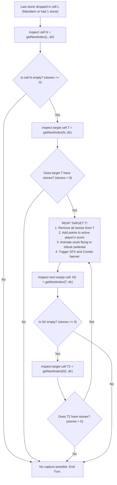

# Context 02: Game Rules & Engine Mechanics

This document provides the definitive specification of the game rules, board graph topology, and state machine algorithms implemented in [src/store.ts](file:///Users/phucdo/Documents/projects/oanquan/src/store.ts).

---

## 1. Traditional Ô Ăn Quan vs. Dark Fantasy Theme

**Ô Ăn Quan** (literally "Mancala of the Mandarins") is a traditional Vietnamese two-player strategy board game. In this application, the game is re-imagined as a ritual on the **Altar of the Fallen Mandarins** (*Điện Thờ Các Quan Tiền Triều*):

| Folk Game Concept | Dark Fantasy Thematic Adaptation | Value in Engine |
|-------------------|----------------------------------|-----------------|
| **Dân** (Citizen / Small Pebble) | **Quân Hồn / Soul Shard** (Levitating amber pebbles) | 1 point |
| **Quan** (Mandarin / Big Stone) | **Chúa Tể Tiền Triều / Fallen Mandarin** (Eldritch crimson core) | 10 points |
| **Ô Dân** (Citizen Square) | **Ô Hồn / Soul Chamber** (Carved stone chambers) | Holds souls |
| **Ô Quan** (Mandarin Semicircle) | **Điện Tế Quan / Altar of the Mandarin** | Semicircular sanctum |
| **Rải quân** (Sowing) | **Nghi Lễ Rải Hồn / Sowing Ritual** | Clockwise / CCW |
| **Ăn luồn** (Skip-capture) | **Đoạt Hồn / Soul Reaping** | Captured to pedestal |
| **Rải quân khi hết quân** | **Nợ Hồn Đền Tế / Altar Debt** | −5 score penalty |

---

## 2. Board Graph Topology (12-Cell Ring)

The board consists of **12 interconnected cells** arranged in a continuous counter-clockwise loop:

```
               [11] Left Mandarin (Quan Trái - Neutral, Owner 0)
                   ▲                                │
                   │                                ▼
  P2 Side ───► [10] ◄────── [9] ◄────── [8] ◄────── [7] ◄────── [6]  (P2 Citizens, Owner 2)
  (Top Row)     (x=-4)     (x=-2)      (x=0)      (x=2)      (x=4)
                │                                                ▲
                ▼                                                │
  P1 Side ───►  [0] ──────► [1] ──────► [2] ──────► [3] ──────► [4]  (P1 Citizens, Owner 1)
  (Bottom Row)  (x=-4)     (x=-2)      (x=0)      (x=2)      (x=4)
                │                                                ▲
                ▼                                                │
               [5] Right Mandarin (Quan Phải - Neutral, Owner 0)
```

### Cell Index Map:
- **Indices `0..4`**: Player 1's five citizen cells (Bottom row, Left to Right, `z = +1.0`).
- **Index `5`**: Right Mandarin semicircular cell (`x = +5.0, z = 0.0`).
- **Indices `6..10`**: Player 2's five citizen cells (Top row, Right to Left, `z = -1.0`).
- **Index `11`**: Left Mandarin semicircular cell (`x = -5.0, z = 0.0`).

### Initial State Configuration:
- Each citizen cell (`0..4` and `6..10`) begins with **5 stones** (value = 1 each). Total citizen stones = 50.
- Each Mandarin cell (`5` and `11`) begins with **1 Mandarin stone** (value = 10 each).
- Total board stone count = 52. Total board score value = 70.

---

## 3. Movement & Directional Traversal

A player may only move on their turn, selecting one of their 5 citizen cells that contains **at least 1 stone**:
- **Player 1** can select cells `0`, `1`, `2`, `3`, or `4`.
- **Player 2** can select cells `6`, `7`, `8`, `9`, or `10`.
- Neither player can initiate a move from a Mandarin cell (`5` or `11`).

### Direction Vectors:
The ring is traversed using modular arithmetic (`% 12`):
```typescript
const getNextIndex = (idx: number, cw: boolean) => 
  cw ? (idx - 1 + 12) % 12 : (idx + 1) % 12;
```
- **CCW (Counter-Clockwise)**: Next index = `(idx + 1) % 12` (moves `0 -> 1 -> ... -> 5 -> 6 ...`).
- **CW (Clockwise)**: Next index = `(idx - 1 + 12) % 12` (moves `4 -> 3 -> ... -> 0 -> 11 ...`).

---

## 4. The Sowing Loop (`sow`)

When a player selects cell `S` and direction `DIR`:
1. **Lifting Phase**:
   - All stones in cell `S` are lifted into `'hand'` state: `cells[S].stones = 0`.
   - SFX `pickup` triggers; golden particle column emits from cell center.
   - Delay: `250ms`.
2. **Distribution Phase**:
   - For each stone in hand:
     - Target index advances by 1 step in `DIR`.
     - 1 stone is deposited: `cells[currentIndex].stones += 1`.
     - Stone's `logicalCell` updates to `currentIndex`.
     - SFX `drop` triggers; dust ripple and amber sparks emit.
     - Delay: `200ms` per drop.
3. **Landing Evaluation**:
   - After the last stone is placed in cell `L`, evaluate the contents and type of `L`:
     - **Case A: `L` is a Citizen cell AND `stones > 1`**:
       - The player picks up all stones in `L` and **continues sowing** in the same direction (`sow()` recurses).
     - **Case B: `L` is a Mandarin cell OR `stones == 1`** (meaning `L` was empty before this stone dropped):
       - Sowing stops immediately.
       - The cell ahead (`nextIndex = getNextIndex(L, dir)`) is evaluated for **Soul Reaping**.

---

## 5. Reaping & Chain Reaping Algorithm (`captureSequence`)

In Vietnamese tradition, this is the prized **Ăn luồn** mechanic:



### Combo Feedback:
- 1 Capture: Standard score floater (`+5`, `+10`).
- 2 Consecutive Captures: **"ĂN ĐÔI / DOUBLE REAP"** banner.
- 3 Consecutive Captures: **"ĂN BA / TRIPLE REAP"** banner.
- 4+ Consecutive Captures: **"ĐẠI THU HOẠCH / SOUL HARVEST"** banner.
- Capturing a Mandarin: **"ĐÃ ĐẬP TAN Ô QUAN / MANDARIN SLAIN"** banner, camera trauma = 0.95, FOV punch = −7.

---

## 6. The "Rải Quân" Stone Debt Rule

If, at the start of a player's turn, **all 5 of their citizen cells are empty** (`totalStones === 0`):
1. The player cannot move naturally.
2. The altar grants an advance of **5 souls**:
   - The player's score is penalized by 5: `score = score - 5` (scores can become negative!).
   - Banner **"RẢI QUÂN — NỢ HỒN / SOULS BORROWED"** displays.
   - Exactly **1 soul** is spawned into each of their 5 citizen cells:
     - Player 1: cells `0, 1, 2, 3, 4` each receive 1 stone.
     - Player 2: cells `6, 7, 8, 9, 10` each receive 1 stone.
3. The player now has valid moves and selects a cell to proceed.

---

## 7. Victory Conditions & End-Game Tally

The game concludes when **both Mandarin cells are completely empty**:
```typescript
if (finalCells[5].stones === 0 && finalCells[11].stones === 0)
```

### End-Game Sweep:
1. All remaining citizen stones on Player 1's side (cells `0..4`) are swept into Player 1's score.
2. All remaining citizen stones on Player 2's side (cells `6..10`) are swept into Player 2's score.
3. Final scores are compared:
   - `p1Score > p2Score`: **Player 1 Wins!**
   - `p2Score > p1Score`: **Player 2 Wins!**
   - `p1Score === p2Score`: **Draw!**
4. Celebration sequence triggers 9 firework bursts of golden and ember particles over the altar plinth, and the Victory overlay renders.
