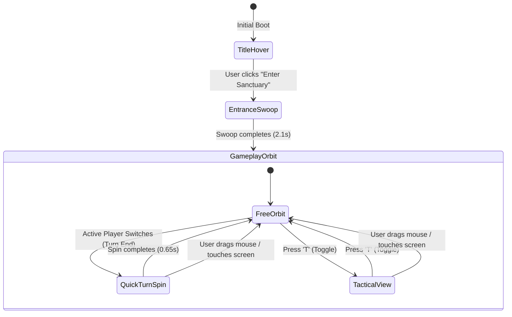

# Context 03: 3D Scene, Camera & Rendering Pipeline

This document details the 3D graphics architecture, camera systems, lighting models, and post-processing pipeline implemented across [src/Game.tsx](file:///Users/phucdo/Documents/projects/oanquan/src/Game.tsx), [src/components/Effects.tsx](file:///Users/phucdo/Documents/projects/oanquan/src/components/Effects.tsx), and [src/components/Board.tsx](file:///Users/phucdo/Documents/projects/oanquan/src/components/Board.tsx).

---

## 1. Canvas Setup & WebGL Configuration

The 3D world is mounted via `@react-three/fiber`'s `<Canvas>` in [src/Game.tsx](file:///Users/phucdo/Documents/projects/oanquan/src/Game.tsx#L169-L174):

```typescript
<Canvas
  shadows
  dpr={[1, 1.75]}
  camera={{ position: isInstant ? [0, 10.5, 14.8] : [0, 4.2, 23.5], fov: BASE_FOV }}
  gl={{
    antialias: false,
    toneMapping: THREE.NoToneMapping,
    powerPreference: 'high-performance'
  }}
>
```

### Critical WebGL Flags:
- `antialias: false`: Anti-aliasing is deliberately disabled at the WebGL context level because post-processing passes (especially N8AO and Bloom) take over smoothing via mipmaps and multisampling (`EffectComposer multisampling={4}`).
- `toneMapping: THREE.NoToneMapping`: Canvas-level tone mapping is disabled so that color channels > 1.0 retain their high-dynamic-range (HDR) values when passing into Bloom shaders. Filmic tone mapping is applied at the tail of the post-processing stack instead.
- `dpr={[1, 1.75]}`: Restricts pixel ratio to 1.75 max to prevent mobile GPU thermal throttling on high-DPI displays.

---

## 2. Dual Lighting Model: Moonlight & Torchlight

The visual atmosphere balances cold gothic moonlight with warm flickering brazier fire:

```
                  Directional Moonlight
                  [-7, 15, 9] (Color: #b4c2ff, Intensity: 2.2)
                            │
                            ▼
        ┌───────────────────┴───────────────────┐
        │                                       │
Torch 3 ▼ [-8.85, 4.15]               Torch 4 ▼ [8.85, 4.15]
(#ff8a3a, PointLight 36)               (#ff8a3a, PointLight 36)
        │       ┌───────────────────────┐       │
        │       │   ANCIENT STONE ALTAR │       │
        │       │  Ambient: #8f9bd0 (0.9│       │
        │       │  Hemi: #6a76b0/#2a1812│       │
        │       └───────────────────────┘       │
Torch 1 ▲ [-8.85, -4.15]              Torch 2 ▲ [8.85, -4.15]
(#ff8a3a, PointLight 36)               (#ff8a3a, PointLight 36)
```

### 1. Cold Moon & Sky Lighting:
- `ambientLight`: Color `#8f9bd0`, intensity `0.9` (prevents pure pitch-black shadows).
- `hemisphereLight`: Sky `#6a76b0`, ground `#2a1812`, intensity `0.55`.
- `directionalLight`: Position `[-7, 15, 9]`, intensity `2.2`, shadow map resolution `2048 x 2048`, shadow camera frustum spanning `[-12..12, -9..9]`, near `1`, far `40`. Normal bias `0.03` eliminates shadow acne on stone plinths.

### 2. Multi-Frequency Torch Flicker:
Each of the 4 braziers calculates procedural flame intensity in [src/components/Atmosphere.tsx](file:///Users/phucdo/Documents/projects/oanquan/src/components/Atmosphere.tsx#L210):
```typescript
const f = 0.85 
  + Math.sin(t * 11.3) * 0.08 
  + Math.sin(t * 23.7) * 0.05 
  + Math.sin(t * 5.1) * 0.06 
  + Math.random() * 0.03;
light.current.intensity = 36 * f;
```
Combining 3 prime harmonic sine frequencies with small stochastic noise creates an authentic, non-repeating fire flicker.

---

## 3. Intelligent Camera Rig (`CameraRig`)

The custom camera rig in [src/Game.tsx](file:///Users/phucdo/Documents/projects/oanquan/src/Game.tsx#L13-L164) manages three distinct states while maintaining full user `OrbitControls` freedom:



### 1. Title Hover Mode:
Gentle floating bob before the sanctuary doors part:
`cam.position.set(cos(t * 0.5) * 0.18, 4.2 + sin(t * 0.8) * 0.12, 23.5)`.

### 2. Entrance Cinematic Swoop:
Glides 2.1 seconds along a cubic curve from the portal threshold into the playable arena:
```typescript
entranceProgress.current += delta / 2.1;
const ease = p < 0.5 ? 4 * p * p * p : 1 - Math.pow(-2 * p + 2, 3) / 2;
cam.position.lerpVectors(titlePos, playPos, ease);
cam.position.y += Math.sin(p * Math.PI) * 1.2; // Vertical arc peak
```

### 3. Quick 180° Turn Auto-Spin (`QuickTurnSpin`):
When a player finishes their move, the camera smoothly and quickly whips 180° (650ms ease-in-out cubic) around the altar so the incoming player has their 5 citizen cells directly in front of them in the foreground:
- **Player 1 Target Angle**: `theta = 0` (looking from +Z toward altar center)
- **Player 2 Target Angle**: `theta = Math.PI` (looking from -Z toward altar center)
- **Shortest Arc Calculation**: Always travels the minimal angular distance along the circle.
- **Manual Control Override**: Touching or dragging the mouse immediately yields control back to `OrbitControls`.

### 4. Tactical Top-Down View (`T` key):
Smoothly damps the spherical polar angle (`phi`):
- Tactical View: `targetPhi = 0.12` (near vertical top-down).
- Cinematic View: `targetPhi = Math.PI / 3` (60° isometric perspective).

---

## 4. Post-Processing Pipeline (`PostFx`)

Implemented in [src/components/Effects.tsx](file:///Users/phucdo/Documents/projects/oanquan/src/components/Effects.tsx#L10-L22) using `@react-three/postprocessing`:

```typescript
<EffectComposer multisampling={4}>
  <N8AO aoRadius={1.6} distanceFalloff={1} intensity={2.2} quality="medium" halfRes color="#000000" />
  <Bloom mipmapBlur intensity={0.95} luminanceThreshold={0.9} luminanceSmoothing={0.25} radius={0.65} />
  <ToneMapping mode={ToneMappingMode.ACES_FILMIC} />
  <ChromaticAberration offset={[0.0007, 0.0009]} radialModulation modulationOffset={0.25} />
  <Vignette eskil={false} offset={0.24} darkness={0.92} />
  <Noise premultiply blendFunction={BlendFunction.SOFT_LIGHT} opacity={0.07} />
</EffectComposer>
```

| Pass | Parameters | Visual Purpose |
|------|------------|----------------|
| **N8AO** | `aoRadius: 1.6`, `intensity: 2.2` | High-quality screen-space ambient occlusion grounding cells and stones |
| **Bloom** | `mipmapBlur: true`, `luminanceThreshold: 0.9` | Renders emissive runes, braziers, and embers with soft golden halos |
| **ToneMapping** | `ACES_FILMIC` | Compresses high-intensity HDR highlights without color clipping |
| **Chromatic Aberration** | Radial offset `[0.0007, 0.0009]` | Subtle lens fringe at screen periphery for cinematic realism |
| **Vignette** | `darkness: 0.92`, `offset: 0.24` | Darkens viewport corners, focusing attention on the altar |
| **Film Grain Noise** | `opacity: 0.07`, `SOFT_LIGHT` | Eliminates color banding in dark gradients and fog |

---

## 5. Camera Trauma, FOV Punch & World Shake

Visual impact ("game juice") is mediated by the global `shake` object in [src/fx.ts](file:///Users/phucdo/Documents/projects/oanquan/src/fx.ts#L48):
```typescript
export const shake = { trauma: 0, fov: 0 };
```

### 1. Trauma Decay (`FxRig`):
Camera FOV remains rock-solid at `BASE_FOV` without disorienting zoom punches or jumps on turn end or captures:
```typescript
shake.trauma = Math.max(0, shake.trauma - delta * 2.0);
shake.fov = 0;
cam.fov = BASE_FOV;
```

### 2. Micro-Vibration World Shake (`ShakeGroup`):
To prevent any camera disorientations or perspective tilting, rotation is locked at `[0, 0, 0]`:
```typescript
const s = shake.trauma * shake.trauma;
const amp = 0.06 * s;
group.position.set(
  Math.sin(t * 47.1) * amp,
  Math.sin(t * 53.7) * amp * 0.4,
  Math.cos(t * 41.3) * amp
);
group.rotation.set(0, 0, 0); // Strictly zero rotation
```

---

## 6. GPU Lifecycle, Texture Disposal & Component Memoization

### 1. Cloned Texture Disposal:
Cloned textures in [src/components/Board.tsx](file:///Users/phucdo/Documents/projects/oanquan/src/components/Board.tsx) (`useTiled`, `runeTex`) are tracked with `useEffect` cleanups:
```typescript
useEffect(() => {
  return () => {
    textures.map.dispose();
    textures.normalMap.dispose();
  };
}, [textures]);
```
This guarantees zero GPU texture memory accumulation across scene re-mounts and hot-module reloads.

### 2. Fiber Reconciliation Memoization:
- **`Cell` Component**: Wrapped in `React.memo` with a selector calculating primitive `stonesValue` (`number`). Unchanged cells skip React reconciliation entirely when stones drop into neighboring cells.
- **`Stone` Component**: Wrapped in `React.memo` with ID comparison (`prev.stone.id === next.stone.id`). Since stone positioning and physics run imperatively inside `useFrame`, eliminating Fiber reconciliation for all 52 stones saves significant CPU cycles during rapid sowing moves.

