# Context 04: Procedural Generation & Textures

This document details the zero-external-asset procedural texture generation system implemented in [src/textures.ts](file:///Users/phucdo/Documents/projects/oanquan/src/textures.ts) and cached in [src/assets.ts](file:///Users/phucdo/Documents/projects/oanquan/src/assets.ts).

---

## 1. Zero-Asset Philosophy

The application loads **zero raster image files** (PNG, JPG, WebP) from disk or network. All textures are synthesized entirely on-the-fly inside HTML5 `<canvas>` elements at application boot using:
1. **Deterministic Seeded PRNG** (Mulberry32).
2. **Procedural Height Map Synthesis** (undulations, pitted impacts, fractured cracks, fine grain).
3. **Sobel Kernel Gradient Filtering** for real-time tangent-space normal maps.
4. **Procedural Glyph Generation** for Elder Futhark runes and summoning sigils.
5. **Radial Gradient Masking** for soft volumetric mist and selection halos.

---

## 2. Deterministic PRNG: Mulberry32

To ensure visual consistency across runs and devices while allowing distinct texture seeds for different materials:
```typescript
function mulberry32(seed: number) {
  return () => {
    seed |= 0;
    seed = (seed + 0x6d2b79f5) | 0;
    let t = Math.imul(seed ^ (seed >>> 15), 1 | seed);
    t = (t + Math.imul(t ^ (t >>> 7), 61 | t)) ^ t;
    return ((t ^ (t >>> 14)) >>> 0) / 4294967296;
  };
}
```

---

## 3. Sobel Height-to-Normal Map Filter

Implemented in [src/textures.ts](file:///Users/phucdo/Documents/projects/oanquan/src/textures.ts#L23-L45), this function converts a 2D grayscale height map canvas into a tileable RGB tangent-space normal map:

```typescript
function heightToNormal(src: HTMLCanvasElement, strength: number): HTMLCanvasElement
```

### Algorithm:
For each pixel `(x, y)`:
1. Sample horizontal difference: `dx = (H(x + 1, y) - H(x - 1, y)) * strength`
2. Sample vertical difference: `dy = (H(x, y + 1) - H(x, y - 1)) * strength`
3. Normalize gradient vector: `len = sqrt(dx² + dy² + 1)`
4. Encode normalized vector into RGB normal map color space:
   - `Red   = (-dx / len * 0.5 + 0.5) * 255` (Tangent X)
   - `Green = ( dy / len * 0.5 + 0.5) * 255` (Tangent Y)
   - `Blue  = (  1 / len * 0.5 + 0.5) * 255` (Normal Z)
   - `Alpha = 255`
5. Seamless tiling is guaranteed by wrapping pixel coordinates with modulo arithmetic: `(x + w) % w` and `(y + h) % h`.

---

## 4. Procedural Weathered Stone Sets (`makeStoneSet`)

Generates a matched pair of textures (`map` + `normalMap`):

```mermaid
flowchart LR
    Seed["Seed (e.g. 7 or 23)"] --> PRNG["Mulberry32 PRNG"]
    
    subgraph HeightMap["Canvas 1: Height Map (512x512)"]
        Base["Base 50% Gray"]
        Undulations["260 Rocky Undulations"]
        Impacts["160 Pitted Impacts"]
        Cracks["34 Jagged Fractures with Lit Lips"]
        Grain["30,000 Fine Sand Grains"]
    end
    
    subgraph ColorMap["Canvas 2: Diffuse Color Map"]
        ColdTint["Multiply Cold Slate Tint (#b4b4c4)"]
        Moss["Dark Green Moss on Cracks (rgba(46,78,34,0.42))"]
        Stains["Soot & Blood Stains (rgba(90,10,10,0.28))"]
    end
    
    PRNG --> HeightMap
    HeightMap --> ColorMap
    HeightMap --> Sobel["Sobel Filter (strength: 3.2)"] --> NormalMap["Canvas 3: Tangent Normal Map"]
    
    ColorMap --> DiffuseTex["THREE.CanvasTexture (map)"]
    NormalMap --> NormalTex["THREE.CanvasTexture (normalMap)"]
```



### Generated Texture Sets:
- `stoneSet`: Seed `7`, used for cells, stone plinths, and chamber floors.
- `plinthSet`: Seed `23`, used for the massive outer altar foundation and torches.
- Both use `THREE.RepeatWrapping` and `anisotropy = 8` for crisp diagonal camera perspectives.

---

## 5. Elder Futhark Runic Glyphs (`makeRuneTexture`)

Generates an emissive runic ribbon (`1024 x 128` px) containing **16 unique procedural glyphs**:
- Each glyph consists of a central vertical stem with 1 to 3 directional angled branches (`strokes.push([cx, y0, cx + dir * len, y0 + branchDelta])`).
- Drawn in pure white with a 10px white blur shadow: `g.shadowColor = '#ffffff'; g.shadowBlur = 10;`.
- Rendered on the board perimeter with `THREE.AdditiveBlending`, animated in [src/components/Board.tsx](file:///Users/phucdo/Documents/projects/oanquan/src/components/Board.tsx#L55-L68):
  - Active player's runes flare up and pulse with a breathing sine wave.
  - Inactive player's runes dim into sleep mode.
  - Horizontal texture offset slowly drifts over time (`runeTex.offset.x += delta * 0.01`).

---

## 6. Demonic Summoning Sigils (`makeSigilTexture`)

Synthesizes the circular magical tribute pedestals where captured souls are stored:
- **Concentric Circles**: Three concentric rings at radii `236px`, `214px`, and `150px`.
- **Runic Ticks**: 24 radial tick marks spaced around the circumference.
- **Inverted Pentagram**: Mathematical five-pointed star connected via polar coordinates:
  ```typescript
  const a = -Math.PI / 2 + ((i * 2) % 5) * (Math.PI * 2 / 5);
  const x = Math.cos(a) * 146;
  const y = Math.sin(a) * 146;
  ```
- Continuously rotates around the Z-axis in [src/components/Board.tsx](file:///Users/phucdo/Documents/projects/oanquan/src/components/Board.tsx#L66): clockwise on Player 1's pedestal, counter-clockwise on Player 2's pedestal.

---

## 7. Volumetric Mist Discs (`makeMistTexture`)

Creates three layered atmospheric fog planes (`512 x 512` px) with a **clear center hole**:
- 90 soft radial gradient cloud puffs cluster around the mid-radius.
- **Center Hole Cutout**: Uses HTML5 canvas composition `destination-out` with a radial gradient at the center (`r = 0.14..0.32`).
- **Purpose**: Ensures that low-lying swirling fog hugs the altar boundaries without obscuring the game pieces, cells, and numbers in the center.

---

## 8. Texture Singleton Cache (`assets.ts`)

To avoid regenerating textures across component re-renders:
```typescript
export const stoneSet = makeStoneSet(7);
export const plinthSet = makeStoneSet(23);
export const runeTexture = makeRuneTexture();
export const sigilTexture = makeSigilTexture();
export const glowRingTexture = makeGlowRingTexture();
export const mistTextures = [makeMistTexture(1), makeMistTexture(2), makeMistTexture(3)];
```
Instantiated exactly once when the module loads, sharing GPU texture memory globally.
