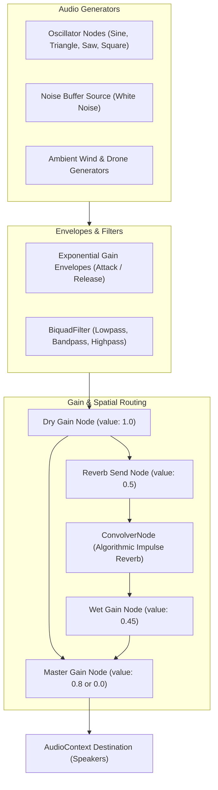

# Context 06: Procedural WebAudio Synthesis

This document details the procedural sound design engine implemented in [src/audio.ts](file:///Users/phucdo/Documents/projects/oanquan/src/audio.ts).

---

## 1. Zero-Asset Audio Philosophy

The game contains **zero audio asset files** (MP3, WAV, OGG). Every acoustic event—from scraping granite slabs and stone soul drops to crystal bell fanfares, subterranean dungeon drones, and iron gate groans—is synthesized in real-time via the browser's native **Web Audio API**.

### Advantages:
- **Instant Boot**: Zero network latency or decoding time for audio assets.
- **Infinite Variation**: Pitch, filter cutoffs, and envelope decay times vary stochastically per trigger, preventing audio fatigue.
- **Microscopic Bundle Size**: The entire audio subsystem comprises under 10 KB of TypeScript code.

---

## 2. Audio Graph Architecture



---

## 3. Algorithmic Reverb Impulse Synthesis

Rather than loading an external impulse response WAV file, [src/audio.ts](file:///Users/phucdo/Documents/projects/oanquan/src/audio.ts#L20-L28) mathematically synthesizes an authentic gothic stone hall convolution impulse:

```typescript
function makeImpulse(c: AudioContext, seconds: number, decay: number): AudioBuffer {
  const len = Math.floor(c.sampleRate * seconds);
  const buf = c.createBuffer(2, len, c.sampleRate);
  for (let ch = 0; ch < 2; ch++) {
    const d = buf.getChannelData(ch);
    for (let i = 0; i < len; i++) {
      d[i] = (Math.random() * 2 - 1) * Math.pow(1 - i / len, decay);
    }
  }
  return buf;
}
```
A 2.6-second stereo impulse with a decay power of 2.4 produces the acoustic signature of a cavernous granite chamber.

---

## 4. Synthesis Primitives

### 1. Filtered Noise Burst (`noise`):
Loops a pre-generated 1-second white noise buffer through a modulated biquad filter and an exponential envelope:
```typescript
function noise(t, dur, type, f0, f1, q, peak, attack = 0.005)
```
- Used for stone scrapes, impacts, and rushing wind.

### 2. Modulated Tone Generator (`tone`):
Oscillators with frequency ramps and exponential gain envelopes:
```typescript
function tone(t, type, f0, f1, dur, peak, attack = 0.004)
```

### 3. Inharmonic Crystal Bell (`bell`):
Synthesizes struck-metal and crystalline resonance using non-integer harmonic partial ratios:
```typescript
function bell(t: number, base: number, peak: number, decay: number) {
  const partials: [number, number][] = [
    [1.00, 1.00], // Fundamental
    [2.76, 0.50], // Inharmonic overtone 1
    [5.40, 0.28], // Inharmonic overtone 2
    [8.93, 0.14], // Inharmonic overtone 3
  ];
  partials.forEach(([m, a], idx) => 
    tone(t, 'sine', base * m, base * m * 0.998, decay / (1 + idx * 0.6), peak * a, 0.002)
  );
}
```

---

## 5. SFX Catalog & Sound Design Recipes

| SFX Method | Synthesis Recipe | In-Game Trigger |
|------------|------------------|-----------------|
| `pickup()` | Bandpass noise sweep (180 -> 520Hz) + low sine (70 -> 55Hz) + triangle overtone (660 -> 990Hz) | Selecting and lifting stones from a cell |
| `drop(big)` | Thud noise (lowpass 450 -> 90Hz) + bell resonance (520Hz for citizen, 180Hz sub for Mandarin) | Depositing a stone during sowing |
| `capture(big)` | Heavy low rumble (lowpass noise 220 -> 40Hz) + sub sine (55 -> 32Hz) + crystal bell (880Hz or 440Hz) | Reaping souls from an opponent's cell |
| `soulArrive()` | High crystal chime (1320Hz) throttled to 120ms max frequency | Soul particle arriving at tribute pedestal |
| `combo(n)` | Ascending pitch fanfare (`base = 330 * 1.15^n`) with triple bell chords | Consecutive chain reap (2x, 3x, etc.) |
| `mandarinSlain(value)` | Sub-bass drop (45 -> 22Hz) + wide noise crash + dual detuned bells (220Hz / 440Hz) | Capturing a Mandarin pit (10 points) |
| `borrow()` | Ominous descending minor triad (440 -> 370 -> 311Hz) with dark hollow noise | "Rải quân" debt penalty (-5 score) |
| `doorOpen()` | Continuous grinding noise (80 -> 340Hz) + deep groaning saws (55 -> 48Hz) | Sanctuary entrance transition |
| `startAmbient()` | Dual resonant bandpass filtered noise (pink wind) + 55Hz low sine drone | Ambient chamber tone |
| `turn()` | Subtle soft bell tap (880Hz) | Turn switching |
| `victory()` | Major chord bell arpeggio (C5 -> E5 -> G5 -> C6) | Game concluded with a winner |
| `draw()` | Neutral hollow bells | Game concluded in a draw |

---

## 6. Audio Unlock & Mute Persistence

- **Browser Audio Unlock**: Browsers require a user gesture before starting the `AudioContext`. [src/audio.ts](file:///Users/phucdo/Documents/projects/oanquan/src/audio.ts#L118-L121) exposes `sfx.unlock()`, called on the initial "Bắt Đầu Nghi Lễ / Enter Sanctuary" button click.
- **Mute Toggle & Storage**:
  - Persisted in browser `localStorage` under key `'oanquan-muted'`.
  - Muting ramps `master.gain` smoothly to `0` over 50ms (`master.gain.setTargetAtTime(0, ctx.currentTime, 0.05)`), avoiding harsh audio clicks.

---

## 7. Audio Graph Node Disconnection & Garbage Collection

In long playing sessions with hundreds of stone drops and harvests, stopping Web Audio nodes (`src.stop()`) without disconnecting them can cause internal node handles to linger in the browser's audio graph thread.

[src/audio.ts](file:///Users/phucdo/Documents/projects/oanquan/src/audio.ts) implements `.onended` cleanup listeners on all ephemeral nodes:
```typescript
src.onended = () => {
  try {
    src.disconnect();
    filt.disconnect();
    g.disconnect();
  } catch {
    /* ignore */
  }
};
```
Additionally, `ctx.resume()` safely attaches `.catch(() => {})` to handle browser autoplay policies gracefully.

