# Context 07: State Management & Data Flow

This document details the reactive state architecture, data schemas, and async action lifecycles implemented in [src/store.ts](file:///Users/phucdo/Documents/projects/oanquan/src/store.ts), [src/fx.ts](file:///Users/phucdo/Documents/projects/oanquan/src/fx.ts), and [src/i18n.ts](file:///Users/phucdo/Documents/projects/oanquan/src/i18n.ts).

---

## 1. Why Zustand over React Context?

In this application, state is shared across **two different React reconcilers**:
1. The standard DOM tree (`#app`).
2. The WebGL 3D Canvas (`<Canvas>`).

### The Problem with React Context:
- Standard React Context cannot cross the `<Canvas>` boundary without third-party context bridges (e.g. `useContextBridge`), which cause substantial memory overhead.
- When a React Context value updates, **all consuming components re-render**. If 3D scene elements re-render on every state change, frame rates plummet from 60+ FPS down to single digits during sowing loops.

### The Zustand Solution:
- **Atomic Selective Subscriptions**: DOM components subscribe strictly to the fields they need:
  ```typescript
  const currentPlayer = useGameStore(s => s.currentPlayer);
  ```
- **Transient Imperative Access**: 3D scene loops (`useFrame`) inspect state synchronously without subscribing or triggering re-renders:
  ```typescript
  useFrame(() => {
    const { dragStartIndex, dragDeltaX } = useGameStore.getState();
    // Directly mutate mesh positions at 60 FPS
  });
  ```
- **Out-of-React Updates**: Async game actions and setTimeout callbacks can update state cleanly via `set()` without needing component hooks.

---

## 2. Store Schemas

### 1. Game State (`useGameStore` in [src/store.ts](file:///Users/phucdo/Documents/projects/oanquan/src/store.ts#L25-L44)):

```typescript
export interface CellData {
  index: number;      // 0..11
  type: 'citizen' | 'mandarin';
  owner: number;      // 1 (P1), 2 (P2), 0 (Neutral Mandarin)
  stones: number;     // Current stone count
  x: number;          // World X position
  z: number;          // World Z position
  width: number;
  depth: number;
}

export interface StoneData {
  id: string;
  logicalCell: number | 'hand' | 'captured1' | 'captured2';
  value: number;      // 1 (citizen) or 10 (mandarin)
  jitterX: number;    // Deterministic random offset within cell
  jitterZ: number;
}

interface GameState {
  cells: CellData[];
  stones: StoneData[];
  currentPlayer: number;   // 1 or 2
  p1Score: number;
  p2Score: number;
  isAnimating: boolean;    // Locks input during sowing/reaping
  winner: string | null;   // null, 'Player 1 Wins!', 'Player 2 Wins!', 'Draw!'
  cellToSow: number | null;// Selected cell awaiting direction choice
  dragStartX: number | null;
  dragStartIndex: number | null;
  dragDeltaX: number;
  
  selectCell: (index: number | null) => void;
  startDrag: (index: number, x: number) => void;
  updateDrag: (x: number) => void;
  endDrag: (x: number) => void;
  executeMove: (startIndex: number, dir: 'cw' | 'ccw') => Promise<void>;
  resetGame: () => void;
}
```

### 2. VFX State (`useFx` in [src/fx.ts](file:///Users/phucdo/Documents/projects/oanquan/src/fx.ts#L30-L43)):

```typescript
interface FxState {
  started: boolean;           // Has entered sanctuary
  doorsOpening: boolean;      // True during 2.4s entrance sequence
  muted: boolean;
  tacticalView: boolean;      // True = top-down; False = cinematic
  grimoireOpen: boolean;      // Rules modal open
  floaters: Floater[];        // Active 3D floating damage texts
  rings: RingData[];          // Active ground shockwave rings
  banner: Banner | null;      // Top center combo/event banner
  
  start: () => void;
  toggleMute: () => void;
  toggleTacticalView: () => void;
  setGrimoireOpen: (open: boolean) => void;
}
```

---

## 3. Async Move Execution Pipeline (`executeMove`)

The core game loop in [src/store.ts](file:///Users/phucdo/Documents/projects/oanquan/src/store.ts#L119-L305) is an asynchronous state machine with timed physical pauses:

```mermaid
sequenceDiagram
    autonumber
    actor Player
    participant Store as useGameStore
    participant FX as fx.ts / audio.ts
    participant UI as DOM HUD & 3D Scene

    Player->>Store: executeMove(startIndex, 'cw' | 'ccw')
    Store->>Store: set({ isAnimating: true, cellToSow: null })
    
    rect rgb(20, 30, 45)
        Note over Store: SOWING RECURSION: sow()
        Store->>FX: fx.pickup(px, pz)
        Store->>Store: Set stones in cell to logicalCell = 'hand'
        Store->>Store: wait 250ms (lifting pause)
        
        loop For each stone in hand
            Store->>Store: Advance currentIndex = getNextIndex(idx, dir)
            Store->>Store: Increment cell.stones, assign stone.logicalCell
            Store->>FX: fx.drop(dx, dz, isMandarin)
            Store->>Store: wait 200ms (drop pause)
        end
        
        Store->>Store: wait 300ms (landing evaluation)
        
        alt Landing in Citizen with >1 stones
            Store->>Store: sow() [Recurses to pick up & continue]
        else Landing in Mandarin OR cell has 1 stone
            Note over Store: Sowing stops. Check next cell.
        end
    end

    rect rgb(45, 20, 30)
        Note over Store: REAPING LOOP: captureSequence(emptyIndex, dir)
        loop While empty cell followed by cell with stones
            Store->>Store: Clear target cell stones
            Store->>Store: Assign stones to 'captured1' or 'captured2'
            Store->>Store: Update player score (+points)
            Store->>FX: fx.capture(cx, cz, value, player, hadMandarin)
            Store->>Store: wait 400ms (reap pause)
        end
    end

    rect rgb(20, 40, 20)
        Note over Store: END TURN: endTurn()
        alt Both Mandarin pits (5 and 11) empty
            Store->>Store: Sweep remaining citizen stones to owners
            Store->>Store: Evaluate winner, set winner state
            Store->>FX: fx.win('win' | 'draw')
        else Game continues
            Store->>Store: Switch currentPlayer (1 <-> 2)
            Store->>FX: fx.turn()
            opt Next player has 0 citizen stones (Rải Quân)
                Store->>Store: wait 500ms
                Store->>Store: Deduct 5 points (score - 5)
                Store->>FX: fx.borrow(nextPlayer)
                Store->>Store: Spawn 1 stone in each of their 5 cells
                Store->>Store: wait 500ms
            end
        end
        Store->>Store: set({ isAnimating: false })
    end
```



---

## 4. Drag & Gesture State Synchronization

Input gestures support both continuous pointer drag and discrete UI button clicks:
1. **Pointer Down** on cell:
   - Sets `dragStartX = e.clientX`, `dragStartIndex = index`, `cellToSow = index`.
2. **Pointer Move** (window listener):
   - Computes `dragDeltaX = e.clientX - dragStartX`.
   - In 3D [src/components/Stone.tsx](file:///Users/phucdo/Documents/projects/oanquan/src/components/Stone.tsx#L44), stones levitate and shift laterally proportional to `dragDeltaX`.
   - In [src/components/Cell.tsx](file:///Users/phucdo/Documents/projects/oanquan/src/components/Cell.tsx#L28-L37), candidate target cells illuminate in blue (`#aaccff`) as drop targets.
3. **Pointer Up**:
   - If `dragDeltaX > +50`: Dispatches `executeMove(dragStartIndex, 'ccw')`.
   - If `dragDeltaX < -50`: Dispatches `executeMove(dragStartIndex, 'cw')`.
   - Resets drag state: `{ dragStartX: null, dragStartIndex: null, dragDeltaX: 0 }`.
