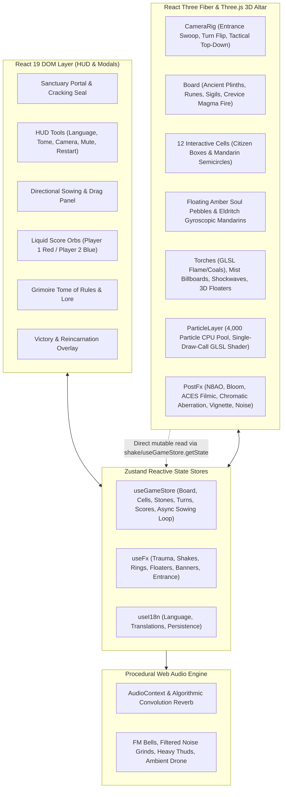

# Ô Ăn Quan: Altar of the Fallen Mandarins — Contexts Library

Welcome to the comprehensive Contexts Library for **Ô Ăn Quan: Altar of the Fallen Mandarins**. This library provides deep, modular, and authoritative architectural, algorithmic, and operational context for human developers and AI coding assistants working on this codebase.

---

## 🗺️ Master Context Map & Quick Navigation

The contexts library is decomposed into specialized, interconnected knowledge domains:

| # | Context Module | Primary Topics & Subsystems | Key Source Files |
|---|----------------|-----------------------------|------------------|
| **01** | [Architecture & System Topology](file:///Users/phucdo/Documents/projects/oanquan/contexts/01-architecture-overview.md) | High-level system architecture, hybrid React DOM + R3F Canvas bridge, tech stack, data pipelines, lifecycle sequence | `src/main.tsx`, `src/App.tsx`, `src/Game.tsx` |
| **02** | [Game Rules & Engine Mechanics](file:///Users/phucdo/Documents/projects/oanquan/contexts/02-game-rules-and-mechanics.md) | Traditional Ô Ăn Quan vs Dark Fantasy lore, 12-cell board graph, sowing algorithm, chain reaping (*ăn luồn*), stone debt (*rải quân*), win triggers | `src/store.ts` |
| **03** | [3D Scene, Camera & Rendering](file:///Users/phucdo/Documents/projects/oanquan/contexts/03-3d-scene-and-rendering.md) | Three.js / R3F scene graph, lighting, cinematic camera rig, turn rotation, tactical top-down view, post-processing stack (N8AO, Bloom, ACES Filmic) | `src/Game.tsx`, `src/components/Effects.tsx`, `src/components/Board.tsx` |
| **04** | [Procedural Generation & Textures](file:///Users/phucdo/Documents/projects/oanquan/contexts/04-procedural-assets-and-textures.md) | Zero-external-asset pipeline, Mulberry32 PRNG, Sobel height-to-normal filter, procedural dungeon stone, Elder Futhark runes, sigils, mist discs | `src/textures.ts`, `src/assets.ts` |
| **05** | [Particle Engine & Visual Effects](file:///Users/phucdo/Documents/projects/oanquan/contexts/05-particle-engine-and-vfx.md) | CPU-managed 4,000 particle pool (Float32Array), single-draw-call GLSL point shader, soul homing vectors, shockwaves, floating combat text, trauma shake | `src/particles.ts`, `src/components/ParticleLayer.tsx`, `src/fx.ts` |
| **06** | [Procedural WebAudio Synthesis](file:///Users/phucdo/Documents/projects/oanquan/contexts/06-audio-synthesis-webaudio.md) | 100% synthetic sound design, AudioContext lifecycle & unlock, algorithmic convolution reverb, noise filters, inharmonic FM bells, ambient drone | `src/audio.ts` |
| **07** | [State Management & Data Flow](file:///Users/phucdo/Documents/projects/oanquan/contexts/07-state-management-and-data-flow.md) | Zustand stores (`useGameStore`, `useFx`, `useI18n`), transient updates vs React render triggers, async action pipelines, why Zustand over React Context | `src/store.ts`, `src/fx.ts`, `src/i18n.ts` |
| **08** | [Spatial Math & Board Layout](file:///Users/phucdo/Documents/projects/oanquan/contexts/08-spatial-math-and-board-layout.md) | 3D coordinate system, cell dimensions & offsets, Mandarin pit centers, Fermat spiral tribute pedestals (`CAPTURE_POS`), torch coordinates | `src/layout.ts`, `src/components/Board.tsx`, `src/components/Stone.tsx` |
| **09** | [UI, HUD & Dark Gothic Theming](file:///Users/phucdo/Documents/projects/oanquan/contexts/09-ui-hud-and-theming.md) | Diablo II aesthetic, sliding stone gates with fracturing demon seal, liquid score orbs, directional sowing controls, Grimoire modal, keyboard shortcuts | `src/App.tsx`, `src/style.css` |
| **10** | [Internationalization & Lore](file:///Users/phucdo/Documents/projects/oanquan/contexts/10-internationalization-i18n.md) | Bilingual Vietnamese (`vi`) and English (`en`) system, localStorage persistence, cultural folk terminology vs dark fantasy nomenclature | `src/i18n.ts` |
| **11** | [Developer Workflows & Recipes](file:///Users/phucdo/Documents/projects/oanquan/contexts/11-developer-guide-and-recipes.md) | Build/dev commands, URL automation flags (`?autostart=1`, `?tactical=1`, `?select=N`, `?instant=1`), recipes for AI Bot, multiplayer, custom stone skins | Project root, `package.json`, `vite.config.ts` |

---

## 🏛️ System Architecture Topology

The application is structured into four primary layers operating synchronously:

---

## ⚡ Zero-External-Asset Principle

A defining architectural characteristic of this project is its **zero-external-asset footprint**:
- **0 image files**: Every texture (weathered dungeon stone, normal maps, elder futhark rune strips, demonic summoning pentagrams, glow halos, noise mist discs) is procedurally generated at boot onto HTML5 `<canvas>` elements and converted to `THREE.CanvasTexture`.
- **0 audio files**: Every sound effect (stone scraping, pebbles dropping, soul harvesting chime fanfares, Mandarin slaying booms, door grinds, wind drone) is algorithmically synthesized via the Web Audio API using mathematical oscillators, noise buffers, and impulse convolution reverb.
- **0 3D models**: All meshes (ancient altar plinth, stone slabs, brazier bowls, flame sheets, gyroscopic orreries, citizen stones) are constructed programmatically from Three.js primitive geometries, shapes, and custom shaders.

---

## 🎯 How to Use This Library

- **When modifying game rules or turns**: Consult [02-game-rules-and-mechanics.md](file:///Users/phucdo/Documents/projects/oanquan/contexts/02-game-rules-and-mechanics.md) and [07-state-management-and-data-flow.md](file:///Users/phucdo/Documents/projects/oanquan/contexts/07-state-management-and-data-flow.md).
- **When adjusting 3D graphics, lighting, shaders, or cameras**: Consult [03-3d-scene-and-rendering.md](file:///Users/phucdo/Documents/projects/oanquan/contexts/03-3d-scene-and-rendering.md) and [08-spatial-math-and-board-layout.md](file:///Users/phucdo/Documents/projects/oanquan/contexts/08-spatial-math-and-board-layout.md).
- **When adding or tuning particle effects or screen shake**: Consult [05-particle-engine-and-vfx.md](file:///Users/phucdo/Documents/projects/oanquan/contexts/05-particle-engine-and-vfx.md).
- **When adding audio cues or background music**: Consult [06-audio-synthesis-webaudio.md](file:///Users/phucdo/Documents/projects/oanquan/contexts/06-audio-synthesis-webaudio.md).
- **When styling UI, HUD, or localization**: Consult [09-ui-hud-and-theming.md](file:///Users/phucdo/Documents/projects/oanquan/contexts/09-ui-hud-and-theming.md) and [10-internationalization-i18n.md](file:///Users/phucdo/Documents/projects/oanquan/contexts/10-internationalization-i18n.md).
- **When writing new features (AI player, multiplayer, skins)**: Consult [11-developer-guide-and-recipes.md](file:///Users/phucdo/Documents/projects/oanquan/contexts/11-developer-guide-and-recipes.md).
